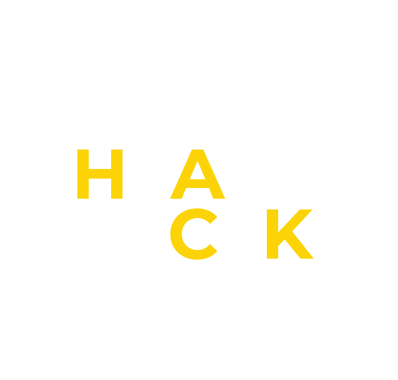
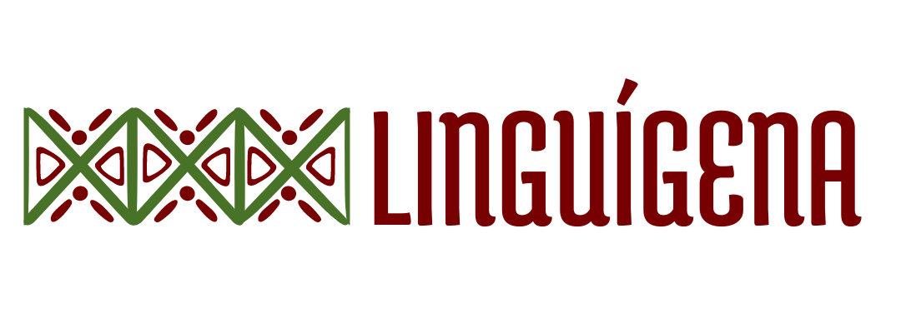
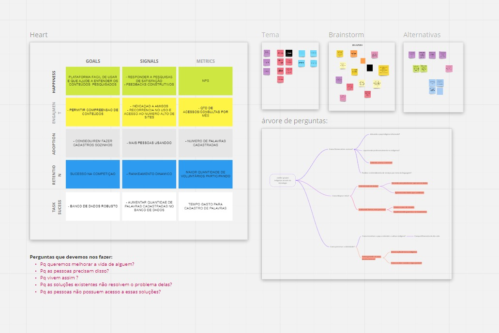
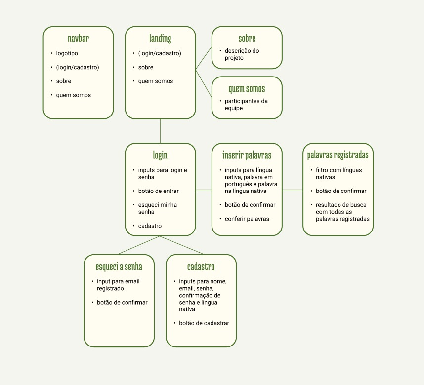
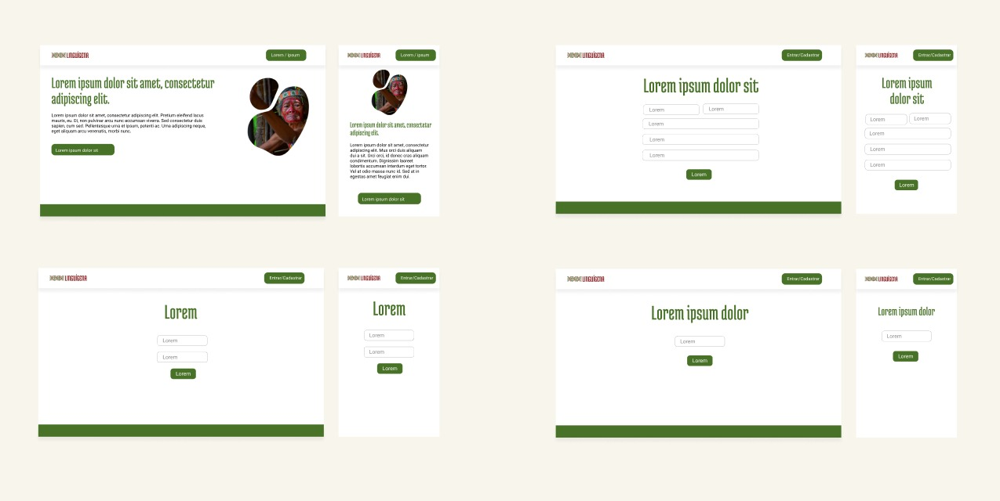
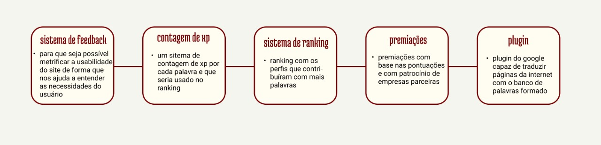

# PROVI HACK PARA TODOS 2021
<div align="center">

</div>                                            
O ProviHack pra Todos é uma iniciativa gratuita da Provi para impulsionar profissionais nas suas carreiras em tecnologia através de experiências dinâmicas, palestras e outras trocas.

O tema prosposto nessa edição é: **Como a tecnologia pode fortalecer grupos minorizados?**

# Linguígena - Time 23


Linguígena é uma plataforma colaborativa capaz de manter o registo da língua visando o seu patrimônio cultural.

## :running: Iniciando o projeto
Clone este repositório em sua máquina
```
$ git clone https://github.com/RafaelSFsoares/proviHack-time23.git
```
### 📋 Pré-requisitos para instalação 
🔧 Instale NodeJS em seu computador. Baixe os arquivos do repositório Linguígena aqui no GitHub. 

Crie um banco de dados no sistema SQL de sua preferência: MySQL, Postegree, SQL Server, SQLITE3. 

Crie uma tabela com o nome colaboradores no banco de sua preferência.

Entre na pasta Back-end e instale via terminal utilizando os seguintes comandos: 
```
 npm init
 npm install -g
 npm install express 
 npm install mysql2 
 npm install sequelize sequelize-cli path 
 npm install cors

```

## :computer: Tecnologias utilizadas
* [Miro](https://miro.com/app/) - Ferramenta de Brainstorm e ideação.
* [Figma](https://www.figma.com/file/js5RqZs96y8STJckKjvIGG/%23ProviHack-Projeto-Luingu%C3%ADgena?node-id=0%3A1) - Design UX-UI.
* [HTML](https://developer.mozilla.org/pt-BR/docs/Web/HTML) - Linguagem de marcação utilizada no Front-end.
* [CSS](https://developer.mozilla.org/pt-BR/docs/Web/CSS) - Utilizado para estilização das páginas no Front-end.
* [JavaScript](https://developer.mozilla.org/pt-BR/docs/Web/JavaScript) - Linguagem utilizada no Front-end.
* [jQuery](https://jquery.com/) - Biblioteca de funções JavaScript que interage com o HTML
* [Bootstrap](https://getbootstrap.com/) - Framework front-end que fornece estruturas de CSS para a criação de sites e aplicações responsivas de forma rápida e simples.
* [NodeJS](https://nodejs.org/pt-br/docs/) - Framework utilizado no Back-end.
* [Sequelize](https://sequelize.org/) - Sequelize é um ORM(Object-Relational Mapper) para NodeJs baseado em promise, utilizado para os bancos de dados: Postgres
* [MySQL](https://www.mysql.com/) -sistema de gerenciamento de banco de dados, que utiliza a linguagem SQL como interface. 

### 💡Brainstorm:


### 🌎Site Map


### Figma


## Próximos passos:


### Desenvolvido por:

🚀 **Matheus Germano** - *Product Owner* - [GitHub](https://github.com/matgermano)

💻 **Camila Rangel** - *Front-end e Designer* - [GitHub](https://github.com/cafrangel)

💻 **Joyce Lusia** - *Front-end* - [GitHub](https://github.com/joycelusia)

⌨️  **Hélio Franco** - *Full Stack* - [GitHub](https://github.com/devHelioFranco)

⌨️  **Rafael Soares** - *Full Stack* - [GitHub](https://github.com/RafaelSFsoares/)

🗺️**Julia Vilela** - *UX Designer* - [Linkedin](https://www.linkedin.com/in/juliavillela24/)

## ▶️ Videos de apresentação:
* [Pitch](https://youtu.be/9mx-QvXyljo)
* [Demo](https://youtu.be/gJSKgQspLwY)

## 📜 Material de Referência: 
* [Links Notion](https://sun-feast-8bc.notion.site/Links-de-material-de-refer-ncia-39f35dd0336544a7839988f20cb716fd)
* [Apresentação](https://www.canva.com/design/DAEw_spLqEI/Qn5dbow3zGMxGQrKPwuJjg/view?utm_content=DAEw_spLqEI&utm_campaign=designshare&utm_medium=link&utm_source=publishpresent)
